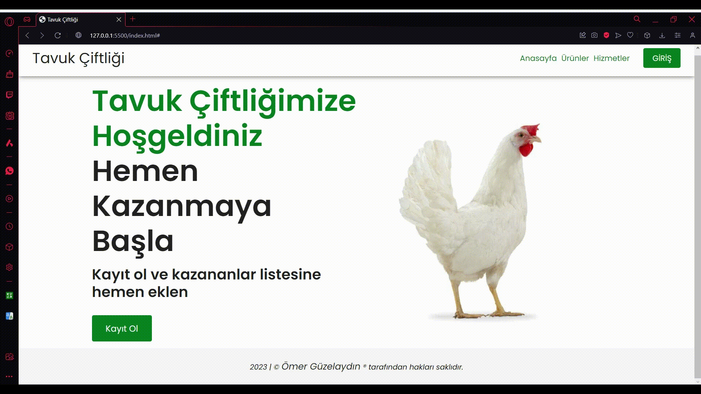

# Tavuk Çiftliği Projesi

Bu proje, tavuk yetiştirme ve çiftlik yönetimi konusunda kapsamlı bilgiler sunan bir web sitesinin ana sayfasını içermektedir. Bu web sitesi, farklı cihazlarda (bilgisayar, tablet, mobil) sorunsuz bir şekilde çalışacak şekilde tasarlanmıştır, böylece her ekran boyutunda en iyi deneyimi elde edebilirsiniz.

## Kullanılan Teknolojiler

- HTML
- CSS
- Bootstrap

## Proje İçeriği

Proje dosyaları şu şekildedir:

- `index.html`: Ana sayfa HTML dosyası
- `styles/style.css`: Proje stil dosyası
- `img/`: Proje görsellerini içeren klasör
- `login.html`: Giriş sayfası HTML dosyası
- `register.html`: Kayıt ol sayfası HTML dosyası
- `README.md`: Proje bilgilerini içeren dosya

## Önizleme

